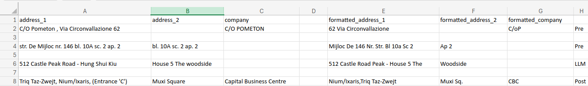

# **Address Formatting Pipeline**  

## **Problem Statement**  

Many e-commerce, logistics, and database systems impose **strict character limits** on address fields, requiring:  
- `address_1` to be **≤35 characters**  
- `address_2` to be **≤10 characters**  

However, real-world addresses vary significantly in length, structure, and formatting across different languages and regions.  

### **Challenges:**  
1. **Data Overflow**: Addresses exceeding character limits get **truncated** or **discarded**, leading to incomplete or incorrect information.  
2. **Redundancy & Duplication**: Key details like city, province, ZIP, and company names are often **repeated** in `address_1` and `address_2`, wasting space.  
3. **Unstructured Formatting**:  
   - Extra spaces, punctuation inconsistencies, and **lack of PascalCase** make addresses **hard to read and process**.  
   - **Phone numbers or special characters** may be embedded in the fields, requiring removal.  
4. **Word Allocation Challenges**: Distributing words between `address_1` and `address_2` while maintaining **readability** and **compliance with length constraints** is non-trivial.  
5. **Company Name Optimization**: Some company names exceed 10 characters, requiring intelligent abbreviation while **preserving meaning**.  

### **Objective**  
This project aims to **clean, optimize, and restructure address fields** using a **multi-stage formatting pipeline** that ensures:  
✅ **Compliance with character limits**  
✅ **Proper word allocation and removal of redundancies**  
✅ **Standardized formatting using PascalCase**  
✅ **Final output that maintains clarity while complying with system constraints**  

---

## **Pipeline Overview**  

This pipeline processes address data in multiple stages, ensuring proper formatting, removing redundancies, and optimizing length constraints.  

---

## **Demo**

## **1. Pre-Processing Modules**  

### **1.1 `pre_formatter.py`**  
This module performs the following operations:  
- **Remove Duplicates**: Eliminates repeated occurrences of `City`, `Company`, `Province`, `ZIP`, and `Country` if already present in `address_1` or `address_2`.  
- **Deduplicate Across Fields**: If a word appears in both `address_1` and `address_2`, it is removed from `address_1` but kept in `address_2`.  
- **Remove Phone Numbers**: Detects and removes any embedded phone numbers in address fields.  
- **Reallocate Overflowing Words**: If `len(address_1) < 34` and `len(address_2) > 10`, words from `address_2` are moved to `address_1`, ensuring `address_1` remains within 35 characters.  
- **Convert to PascalCase**: Transforms both `address_1` and `address_2` to PascalCase format.  

### **1.2 `pre_format_2.py`**  
- Uses regex (`re`) to remove unnecessary spaces under specific conditions.  

### **1.3 `pre_format_3.py`**  
- Removes spaces from `address_2` and converts it into PascalCase.  

---

## **2. LLM Processing Module**  

### **2.1 `llm_format.py`**  
- Processes the addresses row by row using an LLM.  
- Receives the LLM response in JSON format.  
- Saves all processed data into a CSV file.  

---

## **3. Post-Processing Modules**  

### **3.1 `post_format_1.py`**  
Ensures final formatting consistency by:  
- Removing double spaces in the address.  
- Converting the address into PascalCase (capitalizing each word and removing spaces).  
- Removing spaces around punctuation marks such as commas, periods, dashes, and underscores.  
- Truncating `address_1` and `address_2` to their respective character limits.  

### **3.2 `post_format_2.py`**  
- Ensures the string contains only allowed characters.  
- Uses regex (`re`) to remove spaces under specific conditions.  

### **3.3 `post_format_3.py`**  
- Splits `address_2` by spaces, hyphens, and periods.  
- Moves words from `address_2` to `address_1` if needed.  
- Joins the remaining words back into `address_2`.  

### **3.4 `post_format_4.py`**  
- Converts text to PascalCase.  
- Removes all spaces, dots, and commas.  

### **3.5 `post_format_5.py`**  
This module ensures proper word distribution between `address_1` and `address_2`:  
1. Moves the last word from `address_1` to the start of `address_2`.  
2. Checks if the new `address_2` length exceeds 10 characters:  
   - If yes, tries moving the second last word instead.  
   - If still unsuccessful, retains the original structure.  
3. If `address_1` exceeds 35 characters, moves the last word to `address_2`.  

### **3.6 `post_format_6.py`**  
🚫 **Deprecated – Do not use.**  

### **3.7 `post_format_7.py`**  
Optimizes company names by:  
- Removing special characters.  
- Extracting alphabetic and numeric parts separately.  
- Applying adjustments:  
  - If the first word is less than 10 characters, it remains unchanged.  
  - For three-word names, extracts the first letter of each word.  
  - For four-word names, extracts the first letter of each word.  
  - If the total length is still >10 characters, removes spaces.  

---

## **Final Output**  
The processed address fields are **formatted, optimized, and compliant** with system constraints.  
They are then stored in a CSV file for further use. 🚀